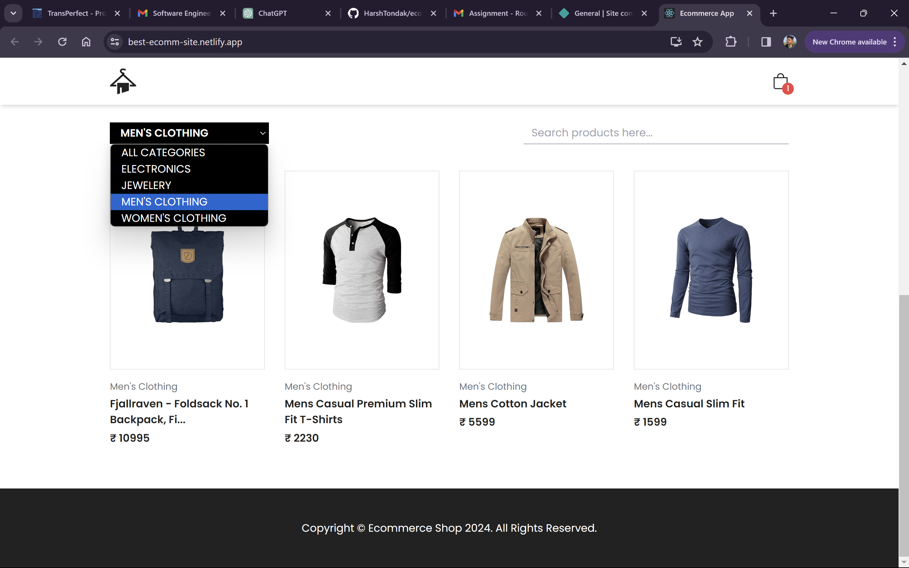

# E-commerce Frontend Website with React

Create an e-commerce banner and list products using React JS/NEXT JS. It is a small web page that we want you to code and try to make it responsive, along with some functionalities. The system will consist of the following functionalities:

- Users should be able to update the product list by changing the category.

- Users should be able to search for the products.

- Search/Filtered results should also be shown in the same manner.

- User should be able to add products into its cart, and the cart should be updated automatically.

## Solution

- The assignment is done using `React.js`.
- I have used the `FakeStoreApi` to fetch the products data.
- `FakeStoreApi: https://fakestoreapi.com/docs`
- I have implemented some extra features like :-
  - Proper Add to Cart Functionality.
  - Cart Total Amount calculation in real time.
  - Increase / Decrease Produtcs Quantity.
  - Empty the whole Cart using single button.
  - Proper Product page for showing the specific product to user in a beautiful manner.
- I utilized React for building modular components and managing application state.
- I implemented navigation between different sections of the ERP system using React Router.
- This website is fully responsive for all screen sizes.

## Demo





## Building the project

Clone the Repository:

```bash
git clone git@github.com:HarshTondak/ecommerce.git
```

## Deployment

Github Repository: [Ecommerce Website](https://github.com/HarshTondak/ecommerce)

This website is hosted using: [Netlify](https://www.netlify.com/)

Hosted Website link is: [Live Ecommerce Website](https://best-ecomm-site.netlify.app/)

**Have fun building!** 🚀
